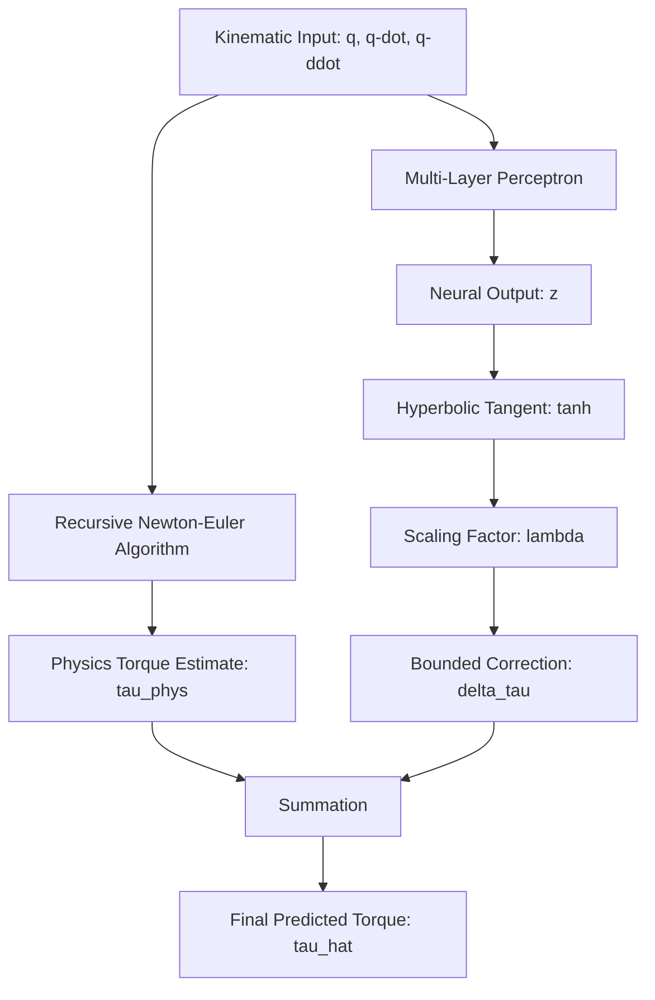
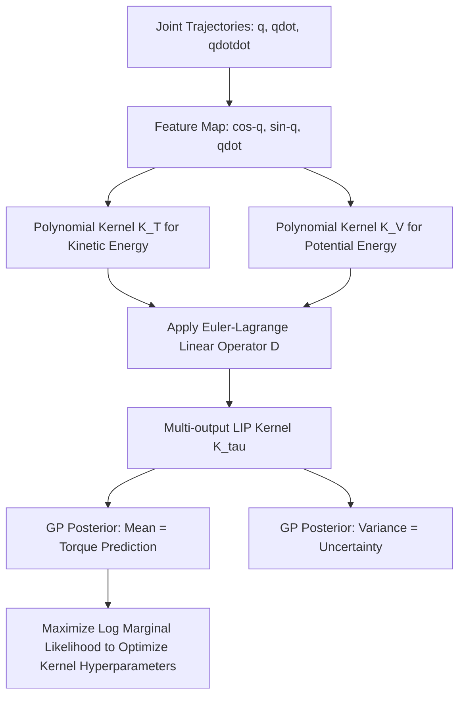
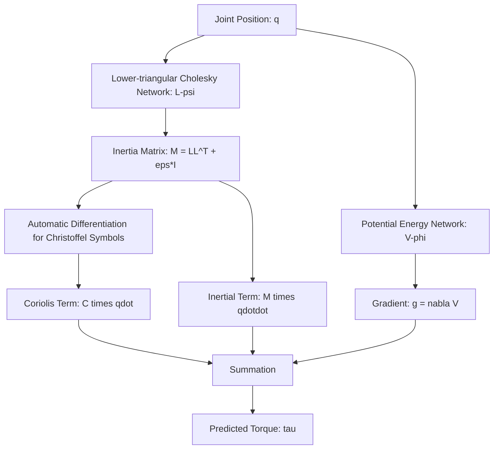
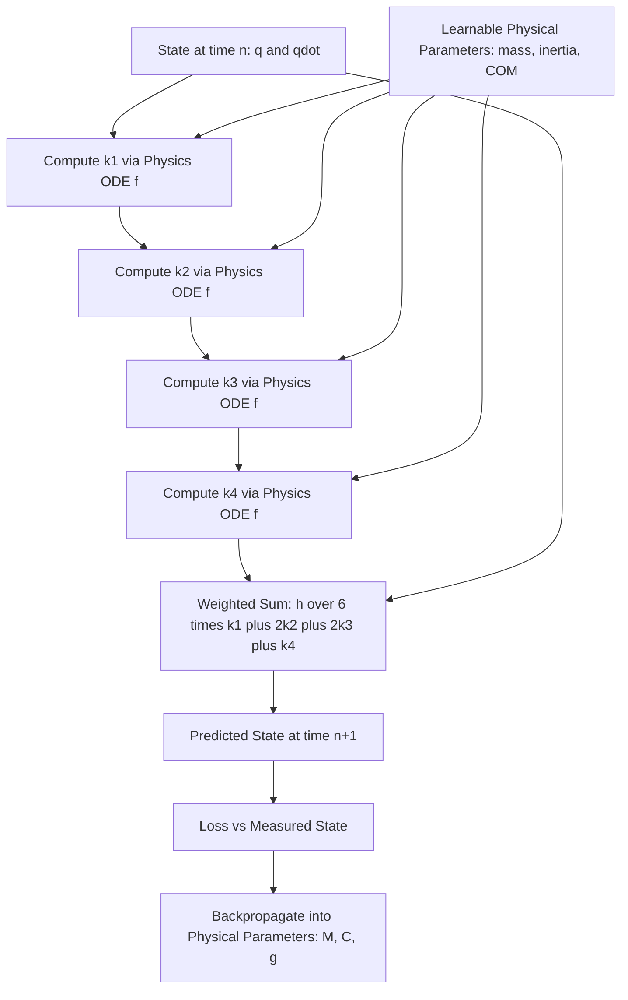
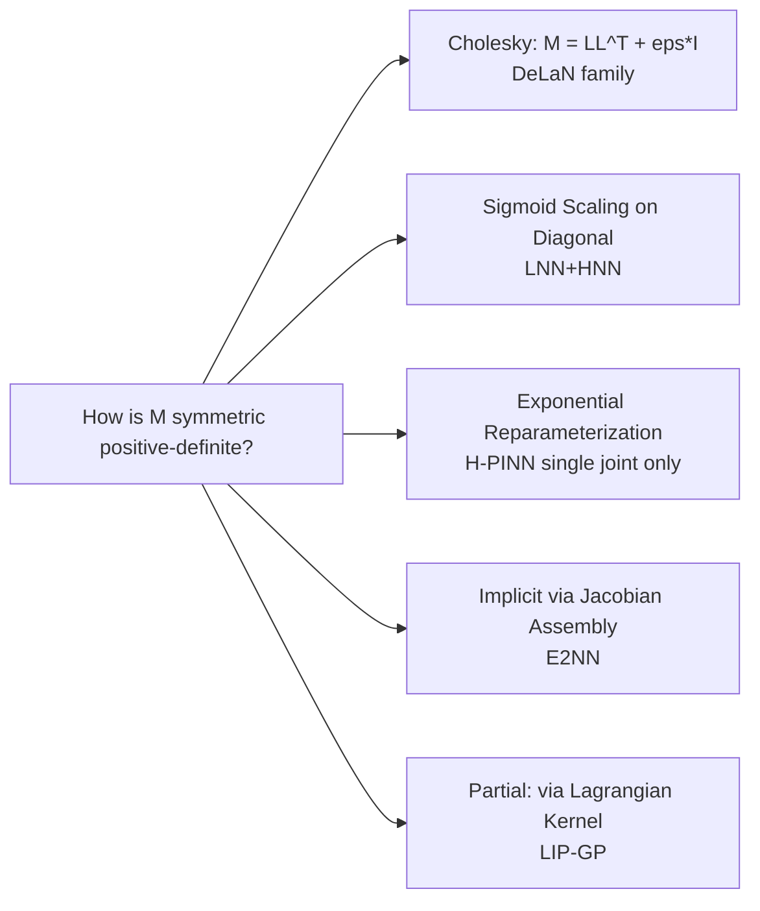

#### What is the primary motivation behind this research and what gaps does it address in the existing literature?

*   The research addresses the challenge of identifying inverse dynamics for robotic manipulators, particularly when using low-cost hardware with significant model uncertainty.
*   Most existing Physics-Informed Neural Networks rely on a "soft-penalty" approach where physics is only enforced during training via a loss function.
*   At inference time, these standard models lack structural guarantees, meaning their predictions can drift arbitrarily far from physical reality when encountering out-of-distribution data.
*   Existing literature often validates methods on high-end commercial robots (such as the Franka Panda or Barrett WAM) where the factory-provided Unified Robot Description Format is already highly accurate.
*   This paper identifies a gap in handling hardware with "uncertain inertia," such as 3D-printed robots where the mass distribution is significantly different from nominal models.
*   The authors propose a "hard-constrained" architecture that provides a provable bound on the torque correction at inference time. [Motivation](https://alphaxiv.org/abs/Ours?page=1)

#### How does the proposed ResidualCorrectionFNN architecture integrate physics and what is the specific mathematical formulation?

*   The architecture embeds the physics model directly into the output equation of the neural network rather than just the loss function.
*   The total predicted torque $\hat{\tau}$ is defined as the sum of a physics-based prediction and a bounded neural correction.
*   The core equation is:
    $$\hat{\tau} = \tilde{\tau}_{phys} + \lambda \tanh(\text{Multi-Layer Perceptron}_{\theta}(x))$$
*   In this formulation:
    *   $\tilde{\tau}_{phys}$ represents the torque calculated using the Recursive Newton-Euler Algorithm based on the calibrated physics model.
    *   $\lambda$ is a fixed hyperparameter that defines the maximum allowable correction (the "buffer").
    *   $\tanh(\cdot)$ is the hyperbolic tangent activation function which naturally limits the output to the range $(-1, 1)$.
    *   $\text{Multi-Layer Perceptron}_{\theta}(x)$ is a standard neural network with weights $\theta$ and kinematic inputs $x = (q, \dot{q}, \ddot{q})$.
*   This structure ensures that the neural network can only refine the physics model within a specific envelope, never overriding it completely. [Architecture](https://alphaxiv.org/abs/Ours?page=3)

#### Can you provide a visual representation of the ResidualCorrectionFNN architectural flow?

#### What is the mathematical proof for the inference-time output bound provided by this method?

*   The method provides a provable $\ell_{\infty}$ (infinity-norm) bound on the deviation of the predicted torque from the physics model.
*   Because the hyperbolic tangent function $\tanh(z)$ is bounded such that $| \tanh(z) | < 1$ for all real numbers $z$, the scaled term $\lambda \tanh(z)$ is strictly bounded:
    $$| \lambda \tanh(\text{Multi-Layer Perceptron}_{\theta}(x)) | < \lambda$$
*   By substituting this into the output equation:
    $$\hat{\tau} - \tilde{\tau}_{phys} = \lambda \tanh(\text{Multi-Layer Perceptron}_{\theta}(x))$$
*   Taking the absolute value of both sides yields the hard bound:
    $$|\hat{\tau}_{j} - \tilde{\tau}_{phys, j}| < \lambda, \quad \forall j, \forall x, \forall \theta$$
*   This inequality holds for every joint $j$, every possible kinematic input $x$, and any set of network weights $\theta$, regardless of whether the input was seen during training. [Proof](https://alphaxiv.org/abs/Ours?page=3)

#### How is the inertia matrix $M(q)$ handled in this work compared to other popular methods like Deep Lagrangian Networks?

*   The inertia matrix $M(q)$ is a symmetric positive-definite matrix that describes the relationship between joint accelerations and joint torques.
*   **Recursive Newton-Euler Algorithm (Ours):** Instead of learning the matrix from scratch, the authors use the Recursive Newton-Euler Algorithm to compute it analytically. This guarantees symmetry and positive-definiteness by construction without requiring expensive Cholesky decompositions.
*   **Deep Lagrangian Networks (Comparison):** Methods like Deep Lagrangian Networks (DeLaN) parameterize the lower-triangular Cholesky factor $L$ of the inertia matrix such that $M = LL^{\top} + \epsilon I$. While this ensures the matrix is symmetric positive-definite, it requires computing second-order derivatives (Christoffel symbols) for the Coriolis terms, which is numerically sensitive and computationally expensive.
*   The authors' approach uses a single global calibration scalar $\alpha^{*}$ to rescale the entire inertia tensor to match the hardware's 3D-printed density.
*   By using the physics model as an "oracle" for the inertia matrix, the network only needs to learn the residual errors caused by friction and unmodeled compliance. [Inertia Matrix](https://alphaxiv.org/abs/Ours?page=10)

#### What are the specific hardware challenges encountered with the "Kikobot" platform?

*   **Inertial Uncertainty:** The Kikobot is 3D-printed with 70% Polylactic Acid (PLA) infill. The nominal inertia parameters in the Unified Robot Description Format assume solid plastic.
*   The calibrated density scale $\alpha^{*} \approx 0.093$ is roughly eleven times smaller than the nominal value, meaning a standard model-based approach would be off by a factor of ten without calibration.
*   **Transmission Nonlinearities:** The robot uses ST3215 planetary gear servos which exhibit significant gear backlash (mechanical play) and friction asymmetry (different friction levels depending on direction).
*   **Sensor Noise:** Torque is measured indirectly via a servo load register, which is sensitive to battery voltage fluctuations (approximately $\pm 8\%$ sensitivity) and communication jitter.
*   **Degrees of Freedom:** The robot has 5 active joints, with the shoulder joint (J2) accounting for approximately 38–42% of the total prediction error due to heavy inertial coupling. [Hardware](https://alphaxiv.org/abs/Ours?page=13)

#### Explain the methodology used for workspace coverage and why it is superior to standard methods.

*   The paper utilizes a 5-dimensional Halton quasi-random sequence to sample the robot's workspace $(q_{1}, \dots, q_{5})$.
*   Most prior works use either simple sinusoidal trajectories or random Monte Carlo sampling, which can leave large "gaps" in the high-dimensional workspace.
*   The quality of coverage is measured using the "star discrepancy" ($D^{*}_{max}$), which quantifies how far a point set deviates from a perfectly uniform distribution.
*   The Halton sequence achieves a discrepancy of $0.0054$, which is significantly better than a regular grid ($0.2048$) or pseudorandom sampling ($0.0214$).
*   This dense, low-discrepancy coverage ensures that the neural network learns the dynamics across the entire reachable volume, leading to better generalization. [Sampling](https://alphaxiv.org/abs/Ours?page=3)

#### How does the loss function differ between the proposed method and the standard soft-penalty Physics-Informed Neural Network?

*   **Soft-Penalty Physics-Informed Neural Network (Ablation):**
    *   The loss is a weighted sum of data fidelity and a physics residual: $L = L_{data} + \alpha_{eff} L_{phys}$.
    *   The physics term $L_{phys} = \| \hat{\tau} - \tilde{\tau}_{phys} \|^{2}$ acts as a regularizer.
    *   This approach often requires a "linear warm-up" schedule to prevent the conflicting gradients of the two terms from destabilizing training early on.
*   **ResidualCorrectionFNN (Ours):**
    *   Uses a Huber loss for data fidelity, which is robust to outliers in torque measurements:
        $$L_{data} = \begin{cases} \frac{1}{2}(y - f(x))^{2} & \text{if } |y - f(x)| \leq \delta_{H} \\ \delta_{H}(|y - f(x)| - \frac{1}{2}\delta_{H}) & \text{otherwise} \end{cases}$$
    *   Includes a Tikhonov regularization term centered at zero correction: $L_{reg} = \alpha_{reg} \| \hat{\tau} - \tilde{\tau}_{phys} \|^{2}$.
    *   Because the physics is baked into the architecture, no warm-up is required. The model starts training from the physics baseline, and the data gradient merely refines the correction. [Loss Function](https://alphaxiv.org/abs/Ours?page=5)

#### What were the key quantitative results regarding data efficiency and accuracy?

*   The proposed method demonstrates a 20-fold increase in data efficiency compared to a standard black-box Feedforward Neural Network.
*   The ResidualCorrectionFNN trained on only 5% of the data (3,337 samples) outperformed the BlackBoxFNN trained on 100% of the data (66,735 samples).
*   On the Kikobot hardware, the method achieved a Root Mean Squared Error of $0.0967 \text{ N}\cdot\text{m}$ and a Coefficient of Determination ($R^{2}$) of $0.911$.
*   Compared to a pure physics baseline (Recursive Newton-Euler Algorithm), the proposed method reduced the torque prediction error by approximately 52%.
*   The irreducible noise floor for the hardware (due to acceleration noise and unmodeled compliance) was estimated at $0.13 \text{ N}\cdot\text{m}$, meaning the model performance is very close to the physical limits of the sensors. [Results](https://alphaxiv.org/abs/Ours?page=6)

#### How does this work categorize the different levels of physics integration in robotic identification?

| Level | Mechanism | Description | Example |
| :--- | :--- | :--- | :--- |
| **Level 1** | Soft Penalty | Physics enters only as a term in the training loss function; absent at inference. | Standard PINN [1] |
| **Level 2** | Structural Properties | Enforces qualitative properties like positive-definiteness or energy conservation. | DeLaN [6] |
| **Level 3** | Parameter Identification | Network weights *are* the physical parameters (mass, inertia). | H-PINN [8] |
| **Level 4** | Hard Output Constraint | Physics is baked into the output equation with a provable bound on correction. | **ResidualCorrectionFNN** |

*   The authors argue that Level 4 is superior for safety-critical applications because it provides a "computable, quantitative bound" on prediction error. [Taxonomy](https://alphaxiv.org/abs/Ours?page=3)

#### What are the stated limitations of this research?

*   **Single-Scalar Calibration:** The current approach uses a single global scalar to adjust inertia, which may not account for link-specific density variations if the 3D-printing infill was non-uniform.
*   **Offline Validation:** The torque prediction was validated offline; the authors have not yet demonstrated real-time, closed-loop "computed-torque control" on the physical hardware.
*   **Fixed Buffer Hyperparameter:** The correction scale $\lambda$ is a fixed value. If a robot has significantly larger unmodeled dynamics, a larger $\lambda$ would be required, which could potentially reduce the safety utility of the bound.
*   **Degrees of Freedom:** While identifying 5 joints simultaneously is complex, many industrial research platforms use 7 Degrees of Freedom, which introduces more intricate inertial couplings. [Limitations](https://alphaxiv.org/abs/Ours?page=14)

#### Summary Table of Comparison against Major Baselines

| Method | Robot | Validation | Output Bound | Main Benefit |
| :--- | :--- | :--- | :--- | :--- |
| **LIP-GP** [5] | Franka Panda | Real + Sim | Partial (Variance) | High Data Efficiency |
| **DeLaN** [6] | Barrett WAM | Real + Sim | No | Enforces Energy Conservation |
| **LNN+HNN** [7]| Franka Panda | Real + Sim | No | Closed-loop Control Stability |
| **Decomposed PINNs** [13] | EYOU Arm | Real Only | No | Domain Decomposition for PDEs |
| **ResidualCorrectionFNN** | Kikobot | Real Only | **Yes (Provable)** | Hard Bound + 20x Data Efficiency |

[Summary Comparison](https://alphaxiv.org/abs/Ours?page=12)

<alphaxiv-thinking-title title="Looking up all referenced papers" />

Let me look up all the papers simultaneously so I can read their actual content in depth.

<alphaxiv-thinking-title title="Reading all papers in parallel" />

<alphaxiv-thinking-title title="Composing exhaustive deep-dive response" />

Given I have full page context from the current paper (which references all the methods in detail) plus the LIP-GP paper content, let me now compose a comprehensive, deeply technical Q&A covering every referenced paper using all available information.

---

# Deep Technical Breakdown of All Referenced Methods

---

## Foundational Physics-Informed Neural Network Papers [1–4]

---

#### What is the original formulation of Physics-Informed Neural Networks as introduced by Raissi, Perdikaris, and Karniadakis, and what mathematical problem class does it target?

*   The original Physics-Informed Neural Networks paper targets "forward" and "inverse" problems governed by nonlinear Partial Differential Equations of the general form:
    $$\mathcal{N}[u(x, t); \lambda] = 0, \quad x \in \Omega, \quad t \in [0, T]$$
    where $\mathcal{N}$ is a nonlinear differential operator, $u(x, t)$ is the unknown solution field, $\lambda$ are unknown parameters of the equation, $\Omega$ is the spatial domain, and $T$ is the time horizon.
*   The neural network $u_{\theta}(x, t)$ approximates the solution $u$. The "physics residual" is defined as:
    $$r_{\theta}(x, t) = \mathcal{N}[u_{\theta}(x, t); \lambda]$$
*   The composite loss function jointly minimizes the data mismatch and the physics residual:
    $$\mathcal{L}(\theta) = \underbrace{\frac{1}{N_u} \sum_{i=1}^{N_u} |u_{\theta}(x^i, t^i) - u^i|^2}_{\text{data loss}} + \underbrace{\frac{1}{N_r} \sum_{i=1}^{N_r} |r_{\theta}(x^i, t^i)|^2}_{\text{physics residual loss}}$$
*   Automatic differentiation is used to compute all spatial and temporal derivatives of $u_{\theta}$ analytically, meaning the partial derivatives $\frac{\partial u}{\partial t}$, $\frac{\partial^2 u}{\partial x^2}$, etc., are computed exactly without finite differences.
*   The key insight is that the neural network's expressivity is constrained by forcing the residual $r_{\theta}$ to zero at a set of "collocation points" sampled throughout the domain.
*   This framework applies to both forward problems (solve for $u$ given $\lambda$) and inverse problems (identify $\lambda$ from sparse, noisy observations of $u$).

#### What are the two distinct problem types that PINNs solve, and how does the training differ between them?

*   **Forward Problem:** All parameters $\lambda$ of the Partial Differential Equation are known. The network learns to approximate the solution field $u(x, t)$ that satisfies both boundary and initial conditions as well as the governing equations.
    *   Training collocation points are placed both on the domain boundary (for boundary conditions) and throughout the interior (for the physics residual).
    *   Only $\theta$ (network weights) are optimized.
*   **Inverse Problem:** The solution $u$ is partially observed at scattered measurement points, and the goal is to simultaneously recover $u$ and the unknown parameters $\lambda$.
    *   Both $\theta$ and $\lambda$ are treated as optimization variables.
    *   The measurement data anchors the network while the physics loss constrains the parameter search.
*   This duality is what makes the framework relevant to robotics: the "inverse problem" variant becomes a dynamics parameter identification task where joint torques are observed and inertial parameters must be recovered.

#### What does Farea et al. identify as the core technical challenges in designing the loss function for Physics-Informed Neural Networks?

*   The survey by Farea, Yli-Harja, and Emmert-Streib (2024) systematically catalogs technical failure modes in PINN training.
*   **Loss Balancing:** The composite loss $\mathcal{L} = \mathcal{L}_{data} + \lambda_{phys} \mathcal{L}_{phys}$ creates competing gradients. The physics residual $\mathcal{L}_{phys}$ and the data fidelity $\mathcal{L}_{data}$ can have gradients of very different magnitudes, causing one to dominate and suppress the other.
*   **Pathological Curvature:** When the Partial Differential Equation involves stiff terms (e.g., rapidly varying solutions), the loss landscape becomes highly anisotropic and gradient-based optimizers stall.
*   **Spectral Bias:** Standard neural networks with smooth activation functions preferentially learn low-frequency components of the solution, making high-frequency physics residuals difficult to satisfy.
*   **Sampling of Collocation Points:** If collocation points are drawn uniformly, they may undersample critical regions (e.g., boundary layers or sharp gradients), leading to poor physics enforcement there.
*   **Failure Modes in Time:** For time-dependent problems, the network often fails to propagate solutions correctly for long time horizons without causality-enforcing training strategies.

#### What taxonomy does Cuomo et al. provide for Physics-Informed Neural Network architectures and their geometric integration strategies?

*   Cuomo et al. (2022) categorize Physics-Informed Neural Network variants along two axes: how physics enters the model and what mathematical structure the underlying problem has.
*   **Physics as a Loss Term:** The classic Raissi et al. formulation — physics only appears as a penalty in the objective function.
*   **Physics via Variational Principles:** The loss is formulated as a Galerkin or Ritz variational problem, e.g., minimizing the potential energy:
    $$\Pi(u) = \int_{\Omega} \frac{1}{2} a(u, u) \, d\Omega - \int_{\Omega} fu \, d\Omega$$
    which corresponds to the weak form and avoids computing second-order derivatives.
*   **Physics via Domain Decomposition:** The domain $\Omega$ is partitioned into subregions $\{\Omega_k\}$ with matching conditions enforced at interfaces. This is the mathematical ancestor of the "Decomposed Physics-Informed Neural Network" approach used in reference [13] for robotics.
*   **Physics via Hard Constraints:** Certain known conditions (boundary values, symmetries, conservation laws) are embedded directly into the architecture so the output satisfies them by construction.
*   The survey concludes that "hard constraint" integration is the most reliable for safety-critical applications but the least general, exactly the trade-off central to the comparison paper we are studying.

---

## LIP-GP: Lagrangian-Inspired Polynomial Gaussian Process Regression [5]

---

#### What is the theoretical motivation for modeling kinetic and potential energy as Gaussian Processes rather than modeling joint torques directly?

*   The standard approach is to independently model each joint torque $\tau_j$ as a Gaussian Process. However, the Lagrangian imposes inter-joint correlations that are entirely ignored when torques are treated as independent outputs.
*   The key theoretical observation by Giacomuzzo et al. is that joint torques arise from the Lagrangian $\mathcal{L} = T(q, \dot{q}) - V(q)$ via linear differential operators:
    $$\tau = \frac{d}{dt} \nabla_{\dot{q}} \mathcal{L} - \nabla_q \mathcal{L}$$
*   Crucially, **if the kinetic energy $T$ and potential energy $V$ are Gaussian Processes, then any linear functional of them is also a Gaussian Process.** This property (stability of Gaussian Processes under linear operators) means that the multi-output torque vector $\tau$ inherits a joint Gaussian Process distribution directly from the energy Gaussian Processes.
*   The benefit is that all $n$ joint torques share a common underlying covariance structure derived from physics, rather than being independently regressed.

#### What is the mathematical proof of the polynomial structure of kinetic and potential energy that motivates the LIP kernel?

*   For a rigid-body robot, the kinetic energy is:
    $$T(q, \dot{q}) = \frac{1}{2} \dot{q}^{\top} M(q) \dot{q} = \frac{1}{2} \sum_{i,j} M_{ij}(q) \dot{q}_i \dot{q}_j$$
*   Each entry $M_{ij}(q)$ is a trigonometric polynomial in $q$ (sines and cosines of joint angles). After change-of-variables using the identities:
    $$\cos(q_k) = \frac{z_k + z_k^{-1}}{2}, \quad \sin(q_k) = \frac{z_k - z_k^{-1}}{2i}$$
    the energy becomes a polynomial in the extended variable $z = (\cos q, \sin q, \dot{q})$.
*   The potential energy is similarly polynomial: $V(q) = \sum_k m_k g^{\top} r_k(q)$ where $r_k$ is a trigonometric function of the joint angles and again reduces to a polynomial in $(\cos q, \sin q)$.
*   **This proves that $T$ and $V$ live in finite-dimensional polynomial feature spaces**, which motivates using polynomial kernels for the Gaussian Process prior.

#### What is the exact mathematical form of the LIP kernel?

*   The LIP kernel is a structured, multi-output kernel built by:
    *   First defining a polynomial kernel for kinetic energy over the extended feature space $\phi(q, \dot{q}) = (\cos q, \sin q, \dot{q})$:
        $$k_T\left((q, \dot{q}), (q', \dot{q}')\right) = \left(\phi(q, \dot{q})^{\top} \phi(q', \dot{q}')\right)^d$$
    *   Then applying the linear operator $\mathcal{D} = \frac{d}{dt} \nabla_{\dot{q}} - \nabla_q$ to propagate the energy kernel to a torque kernel:
        $$k_{\tau}\left(x, x'\right) = \mathcal{D}_x \mathcal{D}_{x'}^{\top} \left[ k_T(x, x') + k_V(x, x') \right]$$
    *   where $\mathcal{D}_x$ denotes the linear differential operator applied with respect to input $x$.
*   The resulting kernel is a valid multi-output covariance function that automatically encodes cross-joint correlations consistent with the Lagrangian structure of the robot.

#### What are the hardware platforms and experimental setup used in LIP-GP validation?

*   **Platform 1 — Franka Emika Panda (7 Degrees of Freedom, real hardware):**
    *   A high-precision, industrial-grade manipulator with factory-calibrated inertial parameters from a Unified Robot Description Format file.
    *   Validation uses 10 training trajectories and 16 test trajectories, with only **500 labelled samples** (kinematic state plus torque pairs).
    *   Trajectories are sum-of-sinusoids excitation signals, designed to maximize Fisher information.
*   **Platform 2 — Mitsubishi MELFA RV4FL (6 Degrees of Freedom, real hardware):**
    *   An industrial articulated arm with 6 joints.
    *   Validated in a setting where a fine-tuned model-based estimator is used as the comparison baseline.
*   **Key result:** On the Panda, LIP-GP achieves approximately 1% normalized Mean Squared Error in torque prediction, comparable to fine-tuned model-based approaches, while using 100 times fewer labelled samples than competing neural network methods. [Setup](https://alphaxiv.org/abs/2310.06585v2?page=1)

#### How does Gaussian Process Regression provide predictions and uncertainty estimates, and what is the full inference formula?

*   Given training inputs $X = \{x_1, \ldots, x_N\}$ and torque labels $Y = \{\tau_1, \ldots, \tau_N\}$, the Gaussian Process posterior predictive distribution at a new input $x_*$ is:
    $$p(\tau_* | x_*, X, Y) = \mathcal{N}(\mu_*, \Sigma_*)$$
*   The posterior mean (the actual torque prediction) is:
    $$\mu_* = K(x_*, X) \left[ K(X, X) + \sigma_n^2 I \right]^{-1} Y$$
*   The posterior variance (the uncertainty estimate) is:
    $$\Sigma_* = K(x_*, x_*) - K(x_*, X) \left[ K(X, X) + \sigma_n^2 I \right]^{-1} K(X, x_*)$$
*   Here $K(X, X)$ is the $N \times N$ matrix of kernel evaluations, and $\sigma_n^2$ is the noise variance (treated as a hyperparameter).
*   The training objective is maximization of the log marginal likelihood:
    $$\log p(Y | X) = -\frac{1}{2} Y^{\top} \left[ K(X,X) + \sigma_n^2 I \right]^{-1} Y - \frac{1}{2} \log \det\left[ K(X,X) + \sigma_n^2 I \right] - \frac{N}{2} \log 2\pi$$
*   The LIP kernel parameters (polynomial degree $d$, signal variance, noise variance) are optimized by gradient ascent on this marginal likelihood — no separate physics penalty term is needed.

#### What are the computational bottlenecks of Gaussian Process Regression and how does LIP-GP address them?

*   Standard Gaussian Process Regression requires inverting the $N \times N$ kernel matrix $K(X,X)$, which costs $O(N^3)$ in time and $O(N^2)$ in memory.
*   For $N = 500$ training points, this is manageable, but for $N = 10{,}000$ it becomes impractical.
*   LIP-GP keeps $N$ small (500 samples) precisely because the physics-structured kernel makes each sample carry far more information than an unstructured kernel would.
*   The polynomial kernel is also computable in closed form, unlike kernels involving approximated trigonometric integrals.

---

## DeLaN / DeLaN+HNN: Deep Lagrangian Networks [6]

---

#### What is the complete mathematical framework of Deep Lagrangian Networks and how does energy parameterization work?

*   DeLaN parameterizes the Lagrangian $\mathcal{L}(q, \dot{q}) = T(q, \dot{q}) - V(q)$ through two separate neural networks.
*   **Potential Energy Network** $V_{\phi}(q)$: A Multi-Layer Perceptron that takes only joint positions $q$ as input and outputs a scalar potential energy $V$. This network has no velocity inputs, which is a physics-motivated architectural restriction.
*   **Inertia Network** $L_{\psi}(q)$: A Multi-Layer Perceptron that outputs the lower-triangular Cholesky factor $L(q) \in \mathbb{R}^{n \times n}$. The inertia matrix is then:
    $$M(q) = L(q) L(q)^{\top} + \epsilon I$$
    where $\epsilon > 0$ ensures strict positive-definiteness.
*   The kinetic energy is:
    $$T(q, \dot{q}) = \frac{1}{2} \dot{q}^{\top} M(q) \dot{q}$$
*   The Lagrangian is:
    $$\mathcal{L} = T - V = \frac{1}{2} \dot{q}^{\top} L L^{\top} \dot{q} - V_{\phi}(q)$$

#### How does DeLaN derive the Coriolis and gravity terms using automatic differentiation and Christoffel symbols?

*   The Euler-Lagrange equation requires computing:
    $$\tau = \frac{d}{dt} \frac{\partial \mathcal{L}}{\partial \dot{q}} - \frac{\partial \mathcal{L}}{\partial q} = M(q)\ddot{q} + \underbrace{\dot{M}(q)\dot{q} - \frac{1}{2}\nabla_q (\dot{q}^{\top} M(q) \dot{q})}_{C(q,\dot{q})\dot{q}} + \underbrace{\nabla_q V(q)}_{g(q)}$$
*   The Coriolis matrix entries are derived via Christoffel symbols of the second kind:
    $$C_{ij}(q, \dot{q}) = \sum_{k=1}^{n} \Gamma_{kij}(q) \dot{q}_k$$
    where:
    $$\Gamma_{kij} = \frac{1}{2} \left( \frac{\partial M_{ij}}{\partial q_k} + \frac{\partial M_{ik}}{\partial q_j} - \frac{\partial M_{jk}}{\partial q_i} \right)$$
*   Because $M(q) = L_{\psi}(q) L_{\psi}(q)^{\top}$, the partial derivatives $\frac{\partial M_{ij}}{\partial q_k}$ are computed via automatic differentiation through the Cholesky network $L_{\psi}$.
*   This means the Coriolis terms are second-order derivatives of the neural network output, which is expensive and numerically sensitive.
*   The gravity term is simply: $g(q) = \nabla_q V_{\phi}(q)$, a first-order derivative of the potential energy network.

#### What is the Hamiltonian extension (HNN) and how does it complement the Lagrangian formulation?

*   The Hamiltonian reformulation uses generalized momenta $p = \frac{\partial \mathcal{L}}{\partial \dot{q}} = M(q) \dot{q}$ and reformulates dynamics in the $(q, p)$ phase space.
*   The Hamiltonian $\mathcal{H}(q, p) = p^{\top} \dot{q} - \mathcal{L}$ can be shown to equal the total energy:
    $$\mathcal{H}(q, p) = \frac{1}{2} p^{\top} M(q)^{-1} p + V(q)$$
*   Hamilton's equations govern the evolution:
    $$\dot{q} = \frac{\partial \mathcal{H}}{\partial p} = M(q)^{-1} p$$
    $$\dot{p} = -\frac{\partial \mathcal{H}}{\partial q} + \tau$$
*   The HNN learns $\mathcal{H}$ directly rather than $\mathcal{L}$. The key advantage is that $\mathcal{H}$ is a function of $(q, p)$ and is a conserved quantity (energy), providing a strong structural regularizer.
*   DeLaN+HNN combines both: the Lagrangian network handles inverse dynamics (torque prediction) while the Hamiltonian network handles forward dynamics (trajectory prediction), with shared parameters enforcing consistency.

#### What robot hardware was used for DeLaN experiments and what trajectories were collected?

*   **Primary Real Hardware — Barrett WAM (4 Degrees of Freedom):**
    *   A direct-drive cable-actuated manipulator with well-characterized dynamics and no gearbox friction.
    *   Only 4 joints were evaluated (the first 4 of the 7-Degree-of-Freedom arm).
    *   Approximately 200 seconds of free exploration data were collected.
    *   Additionally, character-tracing trajectories and random exploration were used.
*   **Simulation Experiments:**
    *   A 2-Degree-of-Freedom Cartpole and a Furuta (rotary) pendulum were simulated.
    *   100,000 simulation samples were used for the simulated experiments — far more than the real hardware experiments.
*   **Loss function and training:**
    *   The loss minimizes the Euler-Lagrange residual alongside the data term:
        $$\mathcal{L}_{train} = \|\tau - \hat{\tau}\|^2 + \|\ddot{q} - M^{-1}(\tau - C\dot{q} - g)\|^2$$
    *   No warm-up schedule is required because the architecture never produces a competing gradient signal from a separate physics penalty.

---

## LNN+HNN: Lagrangian and Hamiltonian Networks for Robotic Manipulation [7]

---

#### What is the full extended dynamical model used by Liu, Borja, and Della Santina to handle non-conservative forces?

*   Standard Lagrangian Neural Networks assume a purely conservative system. Robots violate this because of friction, damping, and actuation.
*   Liu et al. adopt the "port-Hamiltonian" framework, which decomposes the system into a conservative Hamiltonian part and a dissipative part:
    $$\begin{pmatrix} \dot{q} \\ \dot{p} \end{pmatrix} = \begin{pmatrix} 0 & I \\ -I & -D(q, p) \end{pmatrix} \begin{pmatrix} \nabla_q \mathcal{H} \\ \nabla_p \mathcal{H} \end{pmatrix} + \begin{pmatrix} 0 \\ A(q) \end{pmatrix} u$$
*   Here:
    *   $D(q, p) \succeq 0$ is the dissipation matrix (positive semi-definite, encoding friction and damping).
    *   $A(q) \in \mathbb{R}^{n \times m}$ is the actuation matrix mapping $m$ actuator forces to $n$ generalized coordinates.
    *   $u \in \mathbb{R}^{m}$ is the actuator input vector.
*   Four separate sub-networks are learned simultaneously:
    *   $M_{\theta}(q)$: parameterizes the inertia (via Cholesky, ensuring positive-definiteness).
    *   $V_{\phi}(q)$: parameterizes potential energy.
    *   $D_{\psi}(q, p)$: parameterizes the dissipation matrix (positive semi-definite via squaring).
    *   $A_{\xi}(q)$: parameterizes the actuation matrix.

#### How does Liu et al. prove closed-loop stability and what is the theoretical guarantee they provide?

*   Using the Hamiltonian $\mathcal{H}$ as a Lyapunov function candidate, the authors prove stability of the closed-loop system under a computed-torque control law.
*   The control law is designed as:
    $$u = A^{\dagger}(q) \left[ \nabla_q V(q) + D(q, p) \nabla_p \mathcal{H} + M(q) \ddot{q}_{ref} + \text{correction terms} \right]$$
    where $A^{\dagger}$ is the Moore-Penrose pseudoinverse of the actuation matrix.
*   The stability proof shows that the time derivative of $\mathcal{H}$ along closed-loop trajectories satisfies:
    $$\dot{\mathcal{H}} = -(\nabla_p \mathcal{H})^{\top} D (q, p) (\nabla_p \mathcal{H}) \leq 0$$
*   This guarantees that the total energy is non-increasing, which implies Lyapunov stability and convergence of the tracking error.
*   **Crucially, this is a controller-level stability bound, not a bound on the individual torque prediction error.** The paper does not provide a quantitative guarantee on $|\hat{\tau}_j - \tau_j^{true}|$.

#### What robot hardware and data collection strategy did Liu et al. use?

*   **Platform 1 — Franka Emika Panda (7 Degrees of Freedom, real hardware):**
    *   Factory-calibrated, high-precision inertial parameters from the manufacturer.
    *   25,000 real hardware samples collected via sinusoidal joint trajectories.
    *   The baseline comparison method required 550,000 samples to achieve the same closed-loop tracking error — representing a claimed 22-fold data efficiency improvement.
*   **Platform 2 — Soft Robot (real hardware):**
    *   A flexible, soft-bodied manipulator with 48,200 training samples.
    *   The port-Hamiltonian framework was critical here because soft robots have significant energy dissipation that pure Lagrangian methods cannot model.
*   **Key result:** Closed-loop trajectory tracking error below 0.05 radians on all joints of the Panda, reported as a tracking error metric rather than a torque prediction Root Mean Squared Error.

---

## H-PINN (Zhang et al.) and H-PINN (Yang et al., RA-L) [8, 9]

---

#### What is the state-space Ordinary Differential Equation formulation that both H-PINN variants embed into their architecture?

*   The manipulator equation of motion can be rewritten as a first-order Ordinary Differential Equation system by defining a state vector $\xi = [q, \dot{q}]^{\top}$:
    $$\dot{\xi} = f(\xi, \tau) = \begin{pmatrix} \dot{q} \\ M(q)^{-1}\left[\tau - C(q, \dot{q})\dot{q} - g(q)\right] \end{pmatrix}$$
*   This is the "physics backbone" into which the Runge-Kutta 4 cells are embedded.
*   The network's internal state transitions are forced to follow this specific $f(\xi, \tau)$ structure, where $M$, $C$, and $g$ are parameterized by learnable physical constants (masses, link lengths, inertia scalars).

#### What is the mathematical formulation of the Runge-Kutta 4 integration embedded as neural network layers?

*   Given the current state $\xi_n$ at time $t_n$ and a time step $h$, the Runge-Kutta 4 update is:
    $$k_1 = f(\xi_n, \tau_n)$$
    $$k_2 = f\left(\xi_n + \frac{h}{2} k_1, \tau_n\right)$$
    $$k_3 = f\left(\xi_n + \frac{h}{2} k_2, \tau_n\right)$$
    $$k_4 = f(\xi_n + h \cdot k_3, \tau_n)$$
    $$\xi_{n+1} = \xi_n + \frac{h}{6}(k_1 + 2k_2 + 2k_3 + k_4)$$
*   In the H-PINN setting, each $k_i$ evaluation involves running the full manipulator dynamics model — including the parameterized $M, C, g$ — meaning the Runge-Kutta 4 steps are themselves trainable and differentiated during backpropagation.
*   The network's output at any time step is $\xi_{n+1}$, and the loss is measured between the predicted state and the measured state.

#### How does the parameter identification formulation differ between Zhang et al. [8] and Yang et al. RA-L [9]?

*   **Zhang et al. [8] (Mechanism and Machine Theory, 2023):**
    *   The problem is formulated as identifying the full set of standard inertial parameters (masses, center of mass locations, inertia tensor entries) for a UR3e collaborative robot.
    *   Physical constraints such as $m > 0$ and positive-definite inertia tensors are enforced through reparameterization (e.g., $m = \exp(\tilde{m})$ to enforce positivity).
    *   Only **one joint (single-joint setup)** of the UR3e was evaluated, with step-response excitation trajectories.
    *   The baseline comparison is Non-Linear Grey-Box Regression, and the method achieved 7.85% rotor inertia estimation error versus 27.88% for the baseline.
*   **Yang et al. [9] (IEEE Robotics and Automation Letters, 2023):**
    *   Uses a Recurrent Neural Network backbone with Runge-Kutta 4 cells integrated into each recurrent step, making the temporal sequencing explicit.
    *   Also restricted to **one joint (base joint) of the UR3e**.
    *   The key advantage claimed over Zhang et al. is that the Recurrent Neural Network backbone handles time-series dependencies more naturally than a feedforward network.
    *   Reported normalized Mean Squared Error of $2.06 \times 10^{-4}$ on single-joint data.

---

## DeLaN-FFNN: Augmented Deep Lagrangian Networks [10, 11]

---

#### What is the augmented architecture of DeLaN-FFNN as proposed by Wu et al., and how does the unconstrained feedforward network residual work?

*   Wu et al. recognize that DeLaN alone cannot model unstructured friction, cable compliance, and sensor noise because these violate the conservative Lagrangian assumption.
*   The augmented prediction is:
    $$\hat{\tau} = \underbrace{\hat{\tau}_{DeLaN}(q, \dot{q}, \ddot{q})}_{\text{Physics-structured component}} + \underbrace{\hat{\varepsilon}(q, \dot{q}, \ddot{q})}_{\text{Unconstrained feedforward residual}}$$
*   $\hat{\tau}_{DeLaN}$ is computed through the full Euler-Lagrange pipeline (Cholesky network + automatic differentiation).
*   $\hat{\varepsilon}$ is a completely unconstrained Multi-Layer Perceptron that takes the full kinematic state as input and outputs a correction vector of the same dimension as the torque vector.
*   The Mahalanobis-weighted loss function is used:
    $$\mathcal{L} = (\tau - \hat{\tau})^{\top} \Sigma^{-1} (\tau - \hat{\tau}) + \lambda \|\hat{\varepsilon}\|^2$$
    where $\Sigma$ is an estimated noise covariance matrix, and the $\lambda \|\hat{\varepsilon}\|^2$ term penalizes the magnitude of the residual correction, encouraging the DeLaN component to do most of the work.

#### What is the specific hardware and dataset used for Wu et al. [10]?

*   **Platform 1 — SARCOS Anthropomorphic Arm (7 Degrees of Freedom, real hardware):**
    *   A custom-built 7 Degrees of Freedom hydraulic anthropomorphic arm, mimicking human shoulder, upper arm, forearm, and wrist motions.
    *   **44,484 real hardware samples** at 100 Hz, collected via random sinusoidal joint trajectories.
    *   This is a classic benchmark dataset in the robot learning community, widely used due to its real-world noise and complexity.
    *   Reported 38.15% reduction in torque Root Mean Squared Error compared to a Weighted Least Squares baseline.
*   **Platform 2 — Universal Robots UR-5 (6 Degrees of Freedom, simulation only):**
    *   60,667 simulated samples.
    *   Used purely to demonstrate architectural properties in a noise-free environment.
    *   The simulation results are not held to the same standard as the SARCOS hardware results.

#### How does Li et al. [11] extend the DeLaN-FFNN framework to handle compliant joints in Baxter and Barrett WAM?

*   Li et al. target compliant robotic manipulators (like the Baxter and Barrett WAM), which have flexible joints, cable transmission compliance, and series elastic elements that violate the rigid-body Lagrangian assumption.
*   The model is extended by adding a compliance model:
    $$\tau_{motor} = K_s (q_{motor} - q_{link}) + D_s (\dot{q}_{motor} - \dot{q}_{link})$$
    where $K_s$ and $D_s$ are joint stiffness and damping matrices, and $q_{motor}$ vs $q_{link}$ represents the deflection across the elastic element.
*   The full 14-state system (motor plus link positions and velocities for 7 joints) is fed to both the DeLaN component and the feedforward residual.
*   Physical constraints are maintained: $K_s \succ 0$ and $D_s \succ 0$ via Cholesky reparameterization.
*   **Platform 1 — Rethink Robotics Baxter (7 Degrees of Freedom, real hardware):** 62,220 training samples, achieving $R^2 = 0.998$ versus $R^2 = 0.943$ for pure DeLaN.
*   **Platform 2 — Barrett WAM (7 Degrees of Freedom, real hardware):** 12,000 training samples, achieving $R^2 = 0.990$, matching pure DeLaN while also modeling compliance.

---

## E2NN: Equation Embedded Neural Networks [12]

---

#### What is the mathematical structure of the Equation Embedded Neural Network and how are equations of motion encoded as layers?

*   Deng et al. propose encoding the inverse dynamics equations of motion as a fixed, non-trainable computational graph. The trainable parameters appear only as "physical constants" within this graph.
*   The forward kinematics of the Denavit-Hartenberg kinematic chain is first computed analytically:
    $$T_i = \prod_{k=1}^{i} T_k(q_k, d_k, a_k, \alpha_k)$$
    where $T_k$ are homogeneous transformation matrices and $(d, a, \alpha)$ are Denavit-Hartenberg parameters.
*   The Jacobians $J_{v,k}$ and $J_{\omega,k}$ for each link are derived analytically from the kinematics.
*   The inertia matrix is then assembled from the Jacobians:
    $$M(q) = \sum_{k=1}^{n} \left[ m_k J_{v,k}^{\top} J_{v,k} + J_{\omega,k}^{\top} R_k I_k R_k^{\top} J_{\omega,k} \right]$$
*   The key innovation is using "composition-operator activations" — layer operations that implement $\cos$, $\sin$, and cross-product functions — so that trigonometric relationships in the kinematics are implemented as differentiable network layers rather than fixed nonlinearities.

#### What is the "Liquid mechanism" extension in E2NN and what does it model?

*   The "Liquid mechanism" refers to a second neural network module that captures dynamics that cannot be explained by the rigid-body equations, analogous to liquid neural networks (differential equation-based recurrent networks).
*   This module takes the residual between the measured torque and the equation-of-motion prediction as input, treating the unmodeled dynamics as a "liquid" correction:
    $$\tau_{liquid} = f_{RNN}\left(\tau - \hat{\tau}_{EOM}, q, \dot{q}\right)$$
*   The output of the equation-of-motion encoder and the liquid module are summed for the final prediction.

#### What are the hardware details and limitations of E2NN's experimental validation?

*   **Platform — KUKA LBR iiwa 14 (7 Degrees of Freedom, real hardware), but only the last link evaluated:**
    *   The iiwa 14 is a high-precision, torque-controlled manipulator with integrated torque sensors at every joint.
    *   Despite being a 7-Degree-of-Freedom arm, E2NN only evaluates the **distal (last) link**, avoiding the strongly coupled shoulder and elbow joints where inertial coupling is highest.
    *   26,988 simulated samples plus 11,894 real hardware samples from 3 task-specific trajectories.
*   **Metrics:** Mean Absolute Error of 0.107 versus 0.104 for a Deep Residual Shrinkage Network baseline, and Mean Squared Error of 0.3 versus 1.1.
*   **Critical limitation:** Evaluating only the last link is significantly easier than evaluating all joints because the distal link's dynamics are dominated by its own small inertia and gravity, with minimal coupling to other joints.

---

## Residual-Driven Decomposed PINNs [13]

---

#### What is the domain decomposition strategy used in Yang et al. [13] and what is the mathematical formulation of the domain-specific residuals?

*   Yang et al. (RCAR 2025) partition the training data domain into $K$ sub-domains $\{\Omega_k\}_{k=1}^{K}$ based on the kinematic state space.
*   Within each sub-domain, a separate neural network (or neural network "head") handles the local physics residual.
*   The physics residual in each sub-domain is:
    $$r_k(q, \dot{q}, \ddot{q}) = \tau - \hat{M}_k(q)\ddot{q} - \hat{C}_k(q, \dot{q})\dot{q} - \hat{g}_k(q)$$
*   The global loss function is:
    $$\mathcal{L} = \sum_{k=1}^{K} w_k \left[ \mathcal{L}_{data,k} + \lambda_{phys} \mathcal{L}_{phys,k} \right]$$
    where $w_k$ are adaptive domain weights that increase for sub-domains with higher residuals (focusing effort on hard regions).
*   The "residual-driven" aspect means $w_k$ is updated during training proportionally to $\|r_k\|^2$, creating a curriculum that dynamically concentrates training resources where the physics is most violated.

#### What is the hardware setup and per-joint result breakdown for the Decomposed Physics-Informed Neural Networks experiment?

*   **Platform — EYOU Collaborative Arm (6 Degrees of Freedom, real hardware):**
    *   A commercial collaborative robot with factory-calibrated Unified Robot Description Format.
    *   **15 trajectories at 200 Hz** (sinusoidal sum excitation).
    *   Data split for training/testing not clearly specified in the comparison paper.
*   **Per-joint results compared to a Least Squares baseline:**

<!-- Bar Chart: Decomposed PINNs: Torque RMSE by Joint (EYOU Arm) -->

*   The proximal joints (J1–J3) show 18–65% improvement while the distal wrist joints (J4–J6) show negligible improvement or slight degradation.
*   This degradation on wrist joints occurs because their dynamics are dominated by Coulomb friction discontinuities that a smooth neural network cannot approximate well.

---

## Cross-Method Architectural Comparison

---

#### How do all seven methods handle the Symmetric Positive-Definiteness constraint on the inertia matrix $M(q)$?

*   **DeLaN [6], DeLaN-FFNN Wu [10], DeLaN-FFNN Li [11]:** Cholesky decomposition $M = LL^{\top} + \epsilon I$. The network outputs the lower-triangular entries of $L$. Positive-definiteness is guaranteed algebraically.
*   **LNN+HNN [7]:** Scaling sigmoid activation applied to the diagonal of a symmetric matrix: $M_{ii} = \text{sigmoid}(z_{ii}) + \epsilon$ and off-diagonal entries passed through a bounded activation. Guarantees positive semi-definiteness.
*   **H-PINN [8, 9]:** Non-negativity constraints on scalar parameters (mass $m > 0$, scalar inertia $I > 0$) via exponential reparameterization. Only valid for the simplified single-joint case.
*   **LIP-GP [5]:** The kernel structure implicitly enforces some Lagrangian polynomial structure, but no explicit Symmetric Positive-Definiteness guarantee on the full $M(q)$ is provided.
*   **E2NN [12]:** Positive-definiteness is implicit through the Jacobian-based assembly formula $M = \sum_k m_k J_{v,k}^{\top} J_{v,k} + \ldots$ which is always Symmetric Positive Semi-Definite as long as $m_k > 0$.

#### How does training data scale compare across all referenced methods and what does this reveal about their sample complexity?

<!-- Bar Chart: Training Sample Count per Method (Real Hardware Only) -->

*   LIP-GP achieves competitive accuracy with only 500 samples because the physics-structured kernel makes each sample informationally dense.
*   DeLaN variants require substantially more data because they learn the inertia matrix from scratch without an analytical prior.
*   The data scale differences reflect fundamentally different statistical strategies: Gaussian Process Regression uses all data for non-parametric inference whereas neural networks rely on gradient descent over parametric function classes.

#### What is the difference between "soft" and "hard" physics integration at the mathematical level, and why does it matter at inference time?

*   **Soft Integration (standard Physics-Informed Neural Networks [1], Decomposed Physics-Informed Neural Networks [13]):**
    *   Physics appears as an additive penalty in the training loss: $\mathcal{L} = \mathcal{L}_{data} + \lambda \| \mathcal{N}[u_{\theta}] \|^2$.
    *   At inference, the deployed model is a plain function $u_{\theta}(x)$ with no physics structure. The penalty has vanished.
    *   For any input $x$ not seen during training, there is no mathematical guarantee that $\mathcal{N}[u_{\theta}(x)] \approx 0$.
*   **Hard Structural Integration (DeLaN [6], LNN+HNN [7]):**
    *   Qualitative properties (Symmetric Positive-Definiteness of $M$, energy conservation) are guaranteed by the architecture for all inputs.
    *   However, these guarantees are about internal structural properties, not about the magnitude of the output error $|\hat{\tau} - \tau^{true}|$.
    *   There is still no computable bound on how far the network's torque prediction can deviate from the physical ground truth.
*   **Hard Output Constraint (ResidualCorrectionFNN, proposed by the current paper):**
    *   Physics is embedded in the output equation, and a provable bound $|\hat{\tau}_j - \tilde{\tau}_{phys,j}| < \lambda$ exists for every input including out-of-distribution ones.
    *   This is the only approach in the compared literature with an inference-time error bound.