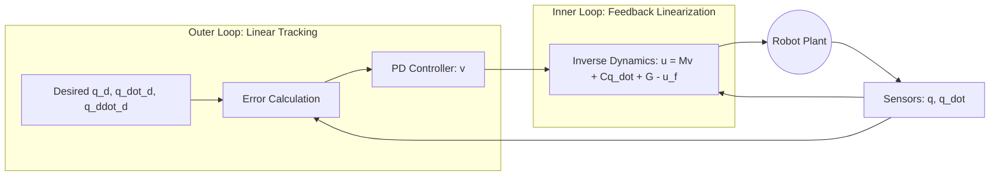
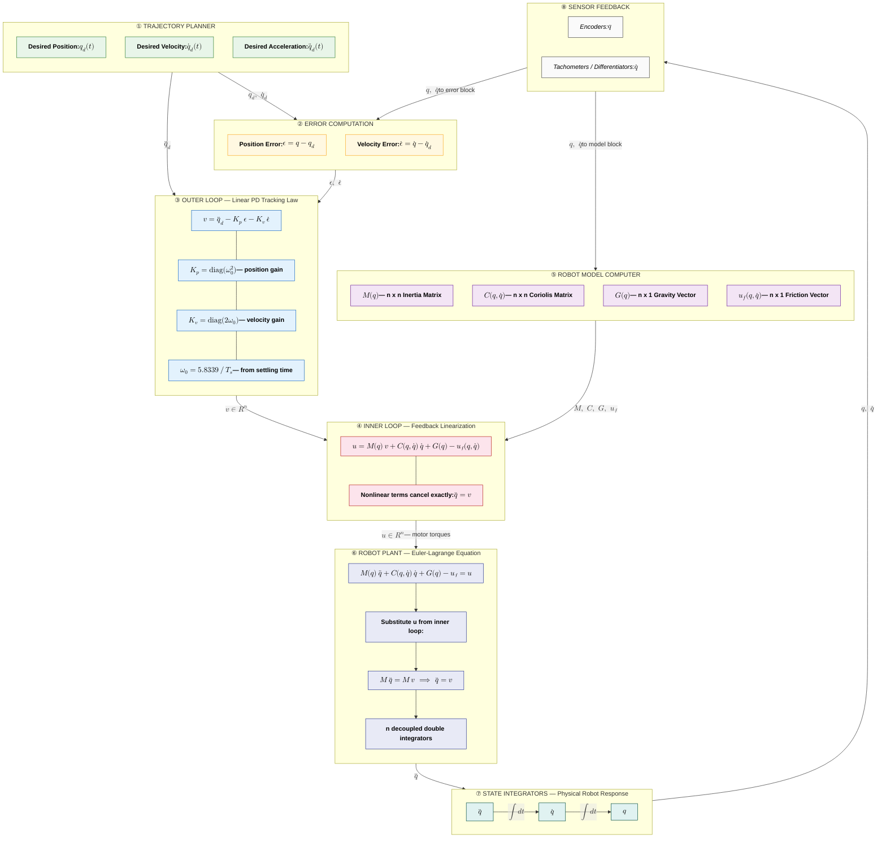

# HOW TO DESIGN, AND TUNE, A COMPUTED TORQUE CONTROLLER: AN INTRODUCTION, AND A MATLAB EXAMPLE

Computed Torque Control (CTC) is a foundational technique in robotics that leverages the known physical model of a robot to "cancel out" nonlinearities, allowing for precise trajectory tracking.

Here is a comprehensive mathematical and engineering breakdown of the paper.

---

### What is the fundamental dynamic model of the robot used in this paper?

The robot is modeled using the Euler-Lagrange equation for an $n$-degree-of-freedom (DOF) system. The dynamics are expressed as:

$$
M(q) \ddot{q} + C(q, \dot{q}) \dot{q} + G(q) - u_f(q, \dot{q}) = u
$$

Where:

- $q, \dot{q}, \ddot{q} \in \mathbb{R}^n$: Vectors representing joint positions, velocities, and accelerations.
- $M(q) \in \mathbb{R}^{n \times n}$: The symmetric, positive-definite mass/inertia matrix.
- $C(q, \dot{q}) \in \mathbb{R}^{n \times n}$: The Coriolis and centrifugal matrix.
- $G(q) \in \mathbb{R}^n$: The gravity vector.
- $u_f(q, \dot{q}) \in \mathbb{R}^n$: Generalized friction forces.
- $u \in \mathbb{R}^n$: The vector of control torques/forces applied by the actuators.

[Dynamics](https://alphaxiv.org/abs/2304.13167?page=1)

### How does the "Feedback Linearization" step simplify these complex dynamics?

The core "trick" of Computed Torque Control is to choose a control law $u$ that algebraically cancels the nonlinear terms of the robot. By defining the control input as:

$$
u = M(q) v + C(q, \dot{q}) \dot{q} + G(q) - u_f(q, \dot{q})
$$

And substituting this into the original dynamics, we observe that:

$$
M(q) \ddot{q} + C \dot{q} + G - u_f = M(q) v + C \dot{q} + G - u_f
$$

Since $M(q)$ is non-singular (invertible), this reduces the system to a set of $n$ decoupled double integrators:

$$
\ddot{q} = v
$$

This transforms a coupled, nonlinear MIMO (Multiple-Input Multiple-Output) system into a simple linear system where $v$ is a new virtual control input.

[Feedback Linearization](https://alphaxiv.org/abs/2304.13167?page=2)

### What is the mathematical architecture of the controller?

The controller uses a "nested" loop structure, often visualized as an inner loop (nonlinear cancellation) and an outer loop (linear tracking).

The outer loop control law $v$ is defined as:

$$
v = \ddot{q}_d - K_p(q - q_d) - K_v(\dot{q} - \dot{q}_d)
$$

[Control Architecture](https://alphaxiv.org/abs/2304.13167?page=3)

### How do we prove the stability and convergence of the tracking error?

Let the tracking error be $\epsilon(t) = q(t) - q_d(t)$. If we substitute the outer loop $v$ into the linearized dynamics $\ddot{q} = v$:

$$
\ddot{q} - \ddot{q}_d + K_v \dot{\epsilon} + K_p \epsilon = 0
$$

$$
\ddot{q} = \ddot{q}_d - K_p \epsilon - K_v \dot{\epsilon}
$$

Which gives us the homogeneous linear second-order error ODE:

$$
\ddot{\epsilon} + K_v \dot{\epsilon} + K_p \epsilon = 0
$$

By choosing $K_p$ and $K_v$ as positive-definite diagonal matrices, the error $\epsilon(t)$ is guaranteed to converge to zero asymptotically ($\lim_{t \to \infty} \epsilon(t) = 0$). This ensures "Global Stability" because the convergence holds regardless of the initial configuration of the robot.

[Error Dynamics](https://alphaxiv.org/abs/2304.13167?page=2)

### What is the engineering rationale for "Critical Damping" in tuning?

In engineering practice, we want the error to decay as fast as possible without overshooting the target or oscillating. This is achieved by tuning the system to be **critically damped**. For each joint $i$, we set:

$$
k_{v,i} = 2\omega_0
$$

$$
k_{p,i} = \omega_0^2
$$

Where $\omega_0$ is the natural frequency. Under critical damping, the error response follows:

$$
\epsilon(t) = [c_1 + c_2 t] e^{-\omega_0 t}
$$

This provides the fastest non-oscillatory return to the equilibrium $\epsilon = 0$.

[Critical Damping](https://alphaxiv.org/abs/2304.13167?page=2)

### How is the natural frequency $\omega_0$ calculated from a desired settling time $T_s$?

The settling time $T_s$ is defined as the time required for the error to drop to $2\%$ of its initial value ($\epsilon(T_s) = 0.02 \epsilon(0)$), assuming $\dot{\epsilon}(0) = 0$.

From the solution $\epsilon(t) = \epsilon_0 (1 + \omega_0 t) e^{-\omega_0 t}$, we solve for $\omega_0$ when $t = T_s$:

$$
(1 + \omega_0 T_s) e^{-\omega_0 T_s} = 0.02
$$

Letting $P = \omega_0 T_s$, the transcendental equation $(1+P) = 0.02 e^P$ yields $P \approx 5.8339$. Thus, the engineering tuning rule is:

$$
\omega_0 \approx \frac{5.8339}{T_s}
$$

[Settling Time](https://alphaxiv.org/abs/2304.13167?page=6)

### What are the critical engineering limitations of the Computed Torque method?

While mathematically elegant, CTC faces several robust engineering challenges:

- **Model Dependency:** The controller relies on an exact mathematical model ($M, C, G$). If the mass of a payload is unknown or friction is modeled incorrectly, the feedback linearization fails, leaving residual nonlinearities that can cause instability.
- **Computational Latency:** The term $u = Mv + C\dot{q} + G - u_f$ must be calculated in real-time at high frequencies (e.g., $1\text{ kHz}$). Solving the inverse dynamics for high-DOF robots is computationally expensive.
- **Torque Saturation:** CTC assumes actuators can provide any required torque $u$. In reality, motors have limits. If the desired $T_s$ is too small, the required $v$ (and thus $u$) may exceed motor limits, leading to "integral windup" or loss of control.
- **Sensor Noise:** Since the control law requires $\dot{q}$, differentiating noisy position signals ($q$) can lead to high-frequency chatter in the torque commands.

> "The main drawback of the law is that it requires a very good model of the robot, otherwise the feedback... will not transform the system into a double integrator as required." [Shortcomings](https://alphaxiv.org/abs/2304.13167?page=4)
> 

---

---

## 🟢 Basics — The Setup

---

### What is the main purpose of this paper?

To teach how to design and tune a **Computed Torque Controller (CTC)** that makes a robot follow a desired trajectory. It also provides a working MATLAB example on a pendulum.

---

### What kind of robot can this controller work on?

Only **fully actuated** robots — robots where every joint has a motor driving it. Examples include robot arms, robot hands, and tree-like mechanisms where every joint is actuated.

[Scope](https://alphaxiv.org/abs/2304.13167?page=1)

---

### What does "fully actuated" mean in simple terms?

It means the number of motors equals the number of joints. Every joint can be directly commanded. If you have 6 joints, you have 6 motors. There are no "passive" or "free" joints.

---

### What is a "trajectory" in this context?

A trajectory is a function $q_d(t)$ that tells you exactly where each joint should be at every moment in time. It is a pre-planned path through joint space, not just a single destination.

[Trajectory](https://alphaxiv.org/abs/2304.13167?page=1)

---

### What is $q$ in the paper's notation?

$q = (q_1, q_2, \ldots, q_n)$ is a vector of $n$ joint coordinates. Each $q_i$ is either an angle (for a revolute joint) or a displacement (for a prismatic joint).

---

### What does $\dot{q}$ represent?

$\dot{q}$ is the first time derivative of $q$, i.e., joint velocity. $\dot{q}_i$ tells you how fast joint $i$ is moving at any given moment.

---

### What does $\ddot{q}$ represent?

$\ddot{q}$ is the second time derivative of $q$, i.e., joint acceleration. $\ddot{q}_i$ tells you how fast the velocity of joint $i$ is changing.

---

### Why do we need $\dot{q}_d(t)$ and $\ddot{q}_d(t)$ in addition to $q_d(t)$?

Because the controller needs to know not just where the robot should be, but how fast it should be moving and how fast that speed should be changing. These are needed to correctly compute the required motor torques.

---

## 🔵 The Robot Model

---

### What is the Euler-Lagrange equation?

It is the fundamental equation of motion for a robot system, derived from energy principles:

$$
M(q)\ddot{q} + C(q, \dot{q})\dot{q} + G(q) - u_f = u
$$

It says: the net motor torque $u$ equals the sum of inertial, Coriolis, gravity, and friction forces.

[Euler-Lagrange](https://alphaxiv.org/abs/2304.13167?page=1)

---

### What is $M(q)$ and why is it important?

$M(q)$ is the $n \times n$ **mass matrix** (also called the inertia matrix). It encodes how much "resistance to motion" exists at each joint. It depends on the current configuration $q$ because as the robot moves, its effective inertia changes.

---

### What does "positive-definite" mean for $M(q)$?

It means for any non-zero vector $x$, $x^T M x > 0$. Physically this guarantees that the kinetic energy $\frac{1}{2}\dot{q}^T M \dot{q}$ is always positive — which makes physical sense since energy cannot be negative.

---

### Why does the invertibility of $M(q)$ matter?

Because the controller needs to solve for $\ddot{q}$ from $M\ddot{q} = \ldots$. Since $M$ is positive-definite, it is always invertible, meaning there is always a unique solution for $\ddot{q}$.

---

### What is $C(q, \dot{q})\dot{q}$ physically?

This term captures **Coriolis and centrifugal forces** — the "phantom" forces that arise because the robot's joints are moving simultaneously. For example, when you spin something and then move it radially, you feel a Coriolis force. Here, $C$ is an $n \times n$ matrix.

---

### What is $G(q)$ and why does it depend only on $q$?

$G(q)$ is the **gravity vector**. It represents the torque each motor must exert just to hold the robot still against gravity. It only depends on $q$ (position) and not $\dot{q}$ (velocity) because gravity depends on configuration, not motion.

---

### What is $u_f$ in the equation?

$u_f(q, \dot{q})$ is the **friction force** at the joints. It models the energy lost due to mechanical friction. It depends on both position and velocity because friction can depend on contact geometry and speed.

---

### What is $u$ on the right-hand side?

$u \in \mathbb{R}^n$ is the vector of **control inputs** — the actual torques or forces delivered by each motor. This is what the controller must compute and send to the hardware.

---

## 🟡 Feedback Linearization

---

### What is the problem with directly controlling a nonlinear system?

The Euler-Lagrange equation is heavily nonlinear and coupled. The behavior at joint 1 affects joint 2, which affects joint 3, and so on. Standard linear controllers (like PID) may not handle this coupling and nonlinearity well across all configurations.

---

### What is the core idea of Feedback Linearization?

The idea is to use a control law $u$ that actively cancels all the nonlinear terms in the robot dynamics, transforming the complex nonlinear system into a simple linear one.

---

### What is the Feedback Linearization control law?

We choose:

$$
u = M(q) v + C(q, \dot{q})\dot{q} + G(q) - u_f
$$

where $v$ is a new virtual input we are free to design. This law "pre-compensates" for all the known physics of the robot.

[Inner Law](https://alphaxiv.org/abs/2304.13167?page=1)

---

### What happens when we substitute the feedback law into the Euler-Lagrange equation?

Substituting $u = Mv + C\dot{q} + G - u_f$ into $M\ddot{q} + C\dot{q} + G - u_f = u$:

$$
M\ddot{q} + \cancel{C\dot{q}} + \cancel{G} - \cancel{u_f} = M v + \cancel{C\dot{q}} + \cancel{G} - \cancel{u_f}
$$

The nonlinear terms cancel perfectly, leaving:

$$
M\ddot{q} = Mv
$$

---

### How do we get from $M\ddot{q} = Mv$ to $\ddot{q} = v$?

Since $M$ is positive-definite (and therefore invertible), we multiply both sides by $M^{-1}$:

$$
M^{-1} M \ddot{q} = M^{-1} M v \implies \ddot{q} = v
$$

This is the simplest possible linear system: a **double integrator**.

[Double Integrator](https://alphaxiv.org/abs/2304.13167?page=2)

---

### What is a "double integrator" and why is it so easy to control?

A double integrator means $\ddot{q} = v$, i.e., the input $v$ directly controls acceleration. Integrating once gives velocity, integrating again gives position. Its behavior is entirely predictable, and classical linear control theory gives us exact tools to design $v$.

---

### How many scalar equations does $\ddot{q} = v$ represent?

It represents $n$ independent scalar equations: $\ddot{q}_1 = v_1,\ \ddot{q}_2 = v_2,\ \ldots,\ \ddot{q}_n = v_n$. Each joint is now decoupled — we can design a controller for each one independently.

[Decoupled ODEs](https://alphaxiv.org/abs/2304.13167?page=2)

---

## 🟠 Designing the Outer Loop Controller

---

### What is the "tracking error" $\epsilon(t)$?

The tracking error is simply how far the robot is from the desired trajectory at time $t$:

$$
\epsilon(t) = q(t) - q_d(t)
$$

When $\epsilon(t) = 0$, the robot is perfectly on the desired trajectory.

---

### How is $v$ chosen to make the error go to zero?

For a single joint (dropping the subscript $i$), we define:

$$
v = \ddot{q}_d - k_p(q - q_d) - k_v(\dot{q} - \dot{q}_d)
$$

The term $\ddot{q}_d$ provides feed-forward acceleration. The $k_p$ and $k_v$ terms actively push the system back toward $q_d$.

---

### What does the $k_p$ term do physically?

$k_p(q - q_d)$ is a **position error correction**. If the robot is behind the desired path, this term pushes it forward. The bigger $k_p$, the more aggressively the controller corrects position error.

---

### What does the $k_v$ term do physically?

$k_v(\dot{q} - \dot{q}_d)$ is a **velocity error correction**. It acts like a damper — if the robot is approaching $q_d$ too fast (risking overshoot), this term slows it down.

---

### How do we derive the "Error ODE" from substituting $v$?

Substitute $v = \ddot{q}_d - k_p \epsilon - k_v \dot{\epsilon}$ into $\ddot{q} = v$:

$$
\ddot{q} = \ddot{q}_d - k_p \epsilon - k_v \dot{\epsilon}
$$

Since $\ddot{\epsilon} = \ddot{q} - \ddot{q}_d$:

$$
\ddot{\epsilon} + k_v \dot{\epsilon} + k_p \epsilon = 0
$$

[Error ODE](https://alphaxiv.org/abs/2304.13167?page=2)

---

### What kind of equation is $\ddot{\epsilon} + k_v \dot{\epsilon} + k_p \epsilon = 0$?

It is a **2nd-order linear homogeneous ODE** with constant coefficients. Its solution is fully determined by the values of $k_p$, $k_v$, and the initial conditions $\epsilon(0)$ and $\dot{\epsilon}(0)$.

---

### Why is this equation "homogeneous" and what does that imply?

Homogeneous means there is no external forcing term on the right-hand side — it equals zero. This means the only thing driving the error dynamics is the error itself, so the error will naturally decay to zero if the gains are chosen correctly.

---

### What conditions on $k_p$ and $k_v$ guarantee $\epsilon(t) \to 0$?

Simply $k_p > 0$ and $k_v > 0$. These conditions ensure the characteristic roots of the error ODE have negative real parts, which means the exponential solution decays over time.

[Convergence](https://alphaxiv.org/abs/2304.13167?page=2)

---

### What is meant by "Global Stability"?

Global stability means the error converges to zero **for any starting point** $q(0)$ and any initial velocity $\dot{q}(0)$. There is no restriction on where the robot starts — the controller always works.

[Global Stability](https://alphaxiv.org/abs/2304.13167?page=3)

---

## 🔴 Gain Tuning and Settling Time

---

### What is the "Harmonic Oscillator" analogy for the error ODE?

The standard harmonic oscillator equation is:

$$
\ddot{x} + 2\xi\omega_0 \dot{x} + \omega_0^2 x = 0
$$

Comparing with our error ODE $\ddot{\epsilon} + k_v \dot{\epsilon} + k_p \epsilon = 0$:

$$
k_v = 2\xi\omega_0, \quad k_p = \omega_0^2
$$

where $\omega_0$ is the **natural frequency** and $\xi$ is the **damping ratio**.

---

### What are the three damping regimes for the error?

| Regime | Condition | Behavior |
| --- | --- | --- |
| Underdamped | $\xi < 1$ | Error oscillates while decaying |
| Critically Damped | $\xi = 1$ | Fastest decay, no oscillation |
| Overdamped | $\xi > 1$ | Slow decay, no oscillation |

---

### Why do we specifically choose critical damping ($\xi = 1$)?

Critical damping gives the **fastest convergence without overshooting**. In robotics, oscillation (underdamping) can cause physical damage or instability. Overdamping is safe but slow. $\xi = 1$ is the sweet spot.

---

### What are the gain formulas under critical damping?

Setting $\xi = 1$:

$$
k_v = 2\omega_0
$$

$$
k_p = \omega_0^2
$$

So once we choose $\omega_0$, both gains are determined. This reduces the tuning problem to a single parameter.

[Critical Gains](https://alphaxiv.org/abs/2304.13167?page=2)

---

### What is the Settling Time $T_s$ definition precisely?

$T_s$ is the time after which the error stays below $2\%$ of its initial value:

$$
|\epsilon(t)| \leq 0.02 |\epsilon(0)|, \quad \forall t \geq T_s
$$

This assumes the robot starts from rest, i.e., $\dot{\epsilon}(0) = 0$.

---

### What is the exact solution of the error ODE under critical damping?

With $\xi = 1$ and $\dot{\epsilon}(0) = 0$, the solution is:

$$
\epsilon(t) = \epsilon(0)(1 + \omega_0 t)e^{-\omega_0 t}
$$

This comes from the general form $\epsilon(t) = (c_1 + c_2 t)e^{-\omega_0 t}$ where $c_1 = \epsilon(0)$ and $c_2 = \epsilon(0)\omega_0$.

[Error Solution](https://alphaxiv.org/abs/2304.13167?page=5)

---

### How do we set up the equation to find $\omega_0$ from $T_s$?

We require $\epsilon(T_s) = 0.02 \cdot \epsilon(0)$:

$$
(1 + \omega_0 T_s) e^{-\omega_0 T_s} = 0.02
$$

Dividing both sides by $\epsilon(0)$ (which cancels), we get a single equation in the unknown $\omega_0 T_s$.

[Settling Equation](https://alphaxiv.org/abs/2304.13167?page=5)

---

### What substitution simplifies the equation $(1 + \omega_0 T_s) e^{-\omega_0 T_s} = 0.02$?

Let $P = \omega_0 T_s$. Then the equation becomes:

$$
(1 + P)e^{-P} = 0.02
$$

Or equivalently: $(1 + P) = 0.02 e^P$. This is a **transcendental equation** (mixes polynomial and exponential) with no closed-form solution — it must be solved numerically.

[Substitution](https://alphaxiv.org/abs/2304.13167?page=6)

---

### What is the numerical solution of $(1+P) = 0.02 e^P$?

The solution is $P \approx 5.8339$. Since $P = \omega_0 T_s$, the tuning formula is:

$$
\omega_0 = \frac{5.8339}{T_s}
$$

This is the key engineering formula: choose your desired settling time $T_s$, and $\omega_0$ follows directly.

[Omega Formula](https://alphaxiv.org/abs/2304.13167?page=6)

---

### If I want the robot to settle in $T_s = 1$ second, what are my gains?

From the formula:

$$
\omega_0 = \frac{5.8339}{1} = 5.8339 \text{ rad/s}
$$

Then:

$$
k_v = 2\omega_0 = 2 \times 5.8339 \approx 11.67
$$

$$
k_p = \omega_0^2 = (5.8339)^2 \approx 34.03
$$

---

### What happens to the gains if I halve the settling time to $T_s = 0.5$ s?

$$
\omega_0 = \frac{5.8339}{0.5} = 11.67 \text{ rad/s}
$$

$$
k_p = (11.67)^2 \approx 136.1, \quad k_v = 2 \times 11.67 \approx 23.34
$$

The gains **quadruple** for $k_p$ and **double** for $k_v$. Faster settling requires much larger control effort.

---

## 🟣 The Full Control Law

---

### What is the final combined control law for a single joint?

Substituting $v$ back into the inner feedback law $u = Mv + C\dot{q} + G - u_f$:

$$
u = M\left[\ddot{q}_d - k_p(q - q_d) - k_v(\dot{q} - \dot{q}_d)\right] + C\dot{q} + G - u_f
$$

[Full Law](https://alphaxiv.org/abs/2304.13167?page=3)

---

### How does the $n$-dimensional version of the outer loop $v$ look?

Using diagonal gain matrices $K_p = \text{diag}(k_{p,1}, \ldots, k_{p,n})$ and $K_v = \text{diag}(k_{v,1}, \ldots, k_{v,n})$:

$$
v = \ddot{q}_d - K_p(q - q_d) - K_v(\dot{q} - \dot{q}_d)
$$

The diagonal structure means each joint is tuned independently.

[N-Dimensional Law](https://alphaxiv.org/abs/2304.13167?page=3)

---

### Why are $K_p$ and $K_v$ diagonal matrices?

Because after feedback linearization, the $n$ joints become **fully decoupled** — joint $i$ only depends on $v_i$. A diagonal matrix means each gain $k_{p,i}$ only acts on the error of joint $i$, with no cross-coupling between joints.

---

### What sensor data does the controller need at every time step?

The controller requires real-time measurements of:

- $q$ — joint positions (e.g., from encoders)
- $\dot{q}$ — joint velocities (e.g., from tachometers or numerically differentiated)

These are needed to compute both the error terms and the model terms $M(q)$, $C(q, \dot{q})$, $G(q)$, $u_f(q, \dot{q})$.

[Sensor Requirements](https://alphaxiv.org/abs/2304.13167?page=3)

---

### What is meant by "solving the inverse dynamics" at each step?

The term $u = Mv + C\dot{q} + G - u_f$ is exactly the **inverse dynamics problem**: given a desired acceleration (here $v$), compute the required torques $u$. This must be solved fast enough to run in real time.

---

## ⚫ Discussion and Limitations

---

### What is the most critical weakness of Computed Torque Control?

It requires a **perfect model** of the robot. If $M, C, G$ or $u_f$ in the controller are wrong (due to wear, unknown loads, or calibration errors), the nonlinear cancellation is imperfect, leaving residual dynamics that can cause tracking errors or instability.

[Main Weakness](https://alphaxiv.org/abs/2304.13167?page=4)

---

### What happens if the robot picks up an unknown payload?

The true $M(q)$ increases (more mass to move), but the controller still uses the old $M$. The inner feedback law will under-compensate, and the system will no longer be a perfect double integrator. The tracking error may not converge to zero as intended.

---

### What is "torque saturation" and why is it dangerous?

Torque saturation means the motor has reached its physical limit and cannot deliver more torque than its rated maximum. If the desired $u$ exceeds this limit, the motor output is clipped, the closed-loop dynamics break down, and convergence is no longer guaranteed.

[Torque Limits](https://alphaxiv.org/abs/2304.13167?page=4)

---

### Why can't we just make $T_s$ arbitrarily small?

Smaller $T_s$ means larger $\omega_0$, which means larger $k_p$ and $k_v$, which demands larger control torques $u$. Eventually the required $u$ exceeds the motor's physical limits, causing saturation. There is a fundamental trade-off between speed and feasibility.

[Trade-off](https://alphaxiv.org/abs/2304.13167?page=4)

---

### What is the trade-off between settling time and motor power?

A smaller $T_s$ leads to larger $\omega_0$. Since $k_p = \omega_0^2$, the position gain grows quadratically with $1/T_s$. This means halving the settling time requires roughly four times the control effort, placing far greater demand on the actuators.

---

### What does the paper say about "powerful motors" in CTC robots?

The paper states that robots controlled by CTC typically use powerful motors precisely because the method makes no effort to minimize control effort. The math assumes unlimited torque, so hardware must keep up.

[Motor Power](https://alphaxiv.org/abs/2304.13167?page=4)

---

### What are "modeling errors" and how do they enter the system?

Modeling errors are discrepancies between the actual robot dynamics and the mathematical model inside the controller. They arise from:

- Unmodeled friction
- Flexible joints/links
- Unknown payloads
- Calibration inaccuracies in joint offsets or link lengths

---

### What is "inverse dynamics control" — is it the same as CTC?

Yes. Some textbooks use "inverse dynamics control" as a direct synonym for "computed torque control." Both refer to the same feedback linearization-based approach. The paper explicitly acknowledges this.

[Terminology](https://alphaxiv.org/abs/2304.13167?page=4)

---

## 🔵 The MATLAB Example

---

### What physical system is used in the MATLAB example?

A simple **actuated pendulum** — a single rod that can rotate freely and is driven by a motor at the pivot. It is the simplest nontrivial robot with one degree of freedom ($n=1$).

---

### What trajectory does the pendulum track in the MATLAB script?

A **step trajectory**: the pendulum starts at rest hanging downward, then tracks a desired path to the inverted (upright) position, and then returns to the bottom.

[Matlab Trajectory](https://alphaxiv.org/abs/2304.13167?page=4)

---

### What disturbance is applied in the example and why?

A perturbation force is applied while the pendulum is balanced upright. This tests the **disturbance rejection** capability of the controller — how well it can recover from unexpected external forces.

[Disturbance](https://alphaxiv.org/abs/2304.13167?page=4)

---

## 🟤 Advanced and Edge Case Questions

---

### Can CTC handle constrained robots (e.g., closed kinematic chains)?

The standard CTC described here is for **unconstrained, fully actuated** robots only. However, the paper acknowledges in a footnote that CTC can be extended to constrained systems, though this is outside the scope of the note.

[Constraints](https://alphaxiv.org/abs/2304.13167?page=1)

---

### Why is the mass matrix $M(q)$ a function of $q$ and not $\dot{q}$?

Because inertia is a geometric property of the robot's configuration. The resistance to acceleration at a joint depends on how the links are arranged spatially, not on how fast they are moving.

---

### What advanced controller can make CTC more robust?

The paper references Spong, Hutchinson, and Vidyasagar's work on designing CTC variants that are **robust to modeling errors, unknown loads, and computational inaccuracies**. These typically add adaptive or robust terms to the outer loop.

[Robust CTC](https://alphaxiv.org/abs/2304.13167?page=4)

---

### What is the relationship between $\omega_0$, $k_p$, and $k_v$ geometrically?

The characteristic polynomial of the error ODE is:

$$
s^2 + k_v s + k_p = 0
$$

Under critical damping, this factors as $(s + \omega_0)^2 = 0$, giving a **repeated root** at $s = -\omega_0$. The further left this root is in the complex plane (larger $\omega_0$), the faster the error decays.

---

### What is the physical meaning of the repeated eigenvalue at $s = -\omega_0$?

The solution $\epsilon(t) = (c_1 + c_2 t)e^{-\omega_0 t}$ grows linearly from $(c_1 + c_2 t)$ initially (the $t$ term) but the exponential $e^{-\omega_0 t}$ wins eventually, pulling the error to zero. The repeated root is what makes the response non-oscillatory.

---

### Can each joint have a different settling time?

Yes. Since the joints are decoupled after feedback linearization, each joint $i$ has its own $k_{p,i}$ and $k_{v,i}$, each tuned with a potentially different $\omega_{0,i}$ from a different desired $T_{s,i}$.

---

### What role does high-frequency control loop execution play?

The model terms $M(q), C(q,\dot{q}), G(q), u_f$ change continuously as the robot moves. If the control loop runs too slowly, the computed $u$ lags behind the true state, reducing the quality of feedback linearization and potentially destabilizing the system.

[Control Frequency](https://alphaxiv.org/abs/2304.13167?page=3)

---

### Why does $C(q, \dot{q})$ depend on both $q$ and $\dot{q}$?

Coriolis forces arise from the interaction between joint velocities and the rotating reference frames of the links. They scale with products of two velocities (e.g., $\dot{q}_i \dot{q}_j$), and the geometric coupling factors depend on the current configuration $q$.

---

### What would happen if we used CTC without the feed-forward term $\ddot{q}_d$?

Without $\ddot{q}_d$, the outer law becomes $v = -k_p \epsilon - k_v \dot{\epsilon}$. This is a pure feedback controller with no feed-forward. It would work but would always lag behind fast trajectories, because corrections only happen after errors occur, not in anticipation.

---

### What does the block diagram tell us about information flow?

The outer (linear) loop uses desired and actual joint states to compute $v$. This $v$ is passed to the inner loop, which uses the current robot state to compute $u$ via the robot model. The robot then updates its state, which feeds back to both loops simultaneously.

[Block Diagram](https://alphaxiv.org/abs/2304.13167?page=3)

---

## What each block does mathematically

| Block | Mathematical Role | Key Equation |
| --- | --- | --- |
| ① Trajectory Planner | Provides the reference signal | $q_d(t),\ \dot{q}_d(t),\ \ddot{q}_d(t)$ |
| ② Error Computation | Measures deviation from reference | $\epsilon = q - q_d,\quad \dot{\epsilon} = \dot{q} - \dot{q}_d$ |
| ③ Outer Loop | Computes virtual input $v$ using linear PD law | $v = \ddot{q}_d - K_p \epsilon - K_v \dot{\epsilon}$ |
| ④ Inner Loop | Cancels nonlinearities using model | $u = M(q)v + C\dot{q} + G - u_f$ |
| ⑤ Robot Model | Evaluates all dynamic terms from current state | $M(q),\ C(q,\dot{q}),\ G(q),\ u_f(q,\dot{q})$ |
| ⑥ Robot Plant | Actual physics — receives torque $u$ | $M\ddot{q} + C\dot{q} + G - u_f = u \Rightarrow \ddot{q} = v$ |
| ⑦ Integrators | Physics of motion — acceleration → velocity → position | $\ddot{q} \xrightarrow{\int} \dot{q} \xrightarrow{\int} q$ |
| ⑧ Sensor Feedback | Closes the loop — reads $q$ and $\dot{q}$ | Feeds back into ② and ⑤ simultaneously |

---

## What is the key "loop within a loop" insight?

The entire architecture is two nested feedback loops working simultaneously:

- The **Inner Loop** runs at the hardware level — it uses the robot model to cancel physics and deliver $\ddot{q} = v$. This loop runs as fast as possible (typically $\geq 1$ kHz).
- The **Outer Loop** runs at the controller level — it uses the now-linear system $\ddot{q} = v$ and applies a simple PD law to drive $\epsilon \to 0$. Its performance is entirely determined by one single design choice: $\omega_0 = \dfrac{5.8339}{T_s}$.