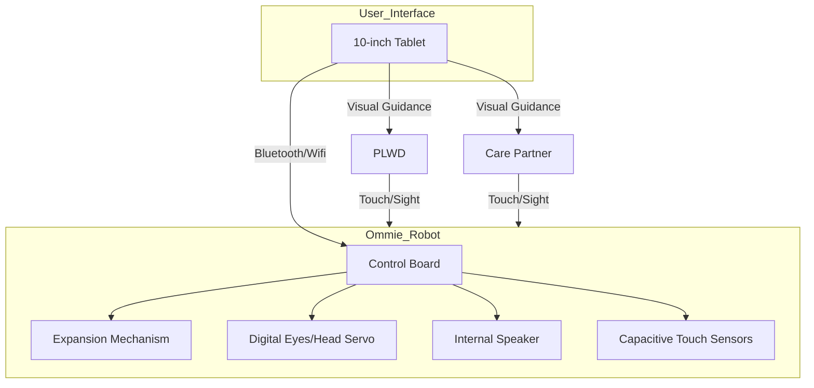
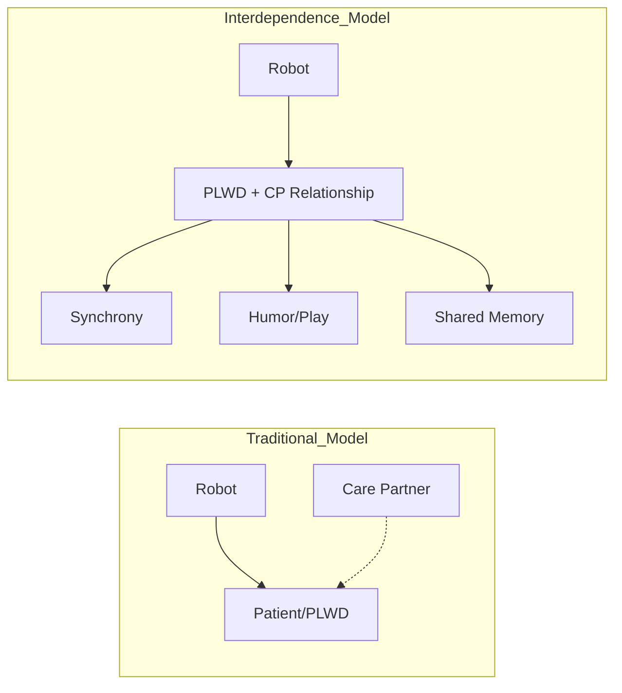

# ween people living with dementia and family care partners

### What were the primary motivations and the core research gap identified by the authors?

- **Emotional Burden of Care:** People living with dementia (PLWD) experience anxiety and isolation, while family care partners (CPs) face severe stress and time constraints, making it difficult to initiate therapeutic activities. [Introduction](https://alphaxiv.org/abs/10.3389/frobt.2026.1772079?page=1)
- **Benefits of Shared Activities:** Joint engagement in music or mindfulness is proven to strengthen bonds, yet CPs often struggle to structure these sessions due to the cognitive load of caregiving. [Introduction](https://alphaxiv.org/abs/10.3389/frobt.2026.1772079?page=2)
- **Gap in Social Robotics:** Most existing robots for dementia focus exclusively on the PLWD (as a patient) rather than the "interdependence" of the care pair. Previous work treated CP benefits as secondary. [Introduction](https://alphaxiv.org/abs/10.3389/frobt.2026.1772079?page=2)
- **The Connective Role:** This paper is among the first to deploy a robot specifically designed to mediate and facilitate *shared* engagement, treating dementia as a collaborative experience rather than an individual pathology. [Introduction](https://alphaxiv.org/abs/10.3389/frobt.2026.1772079?page=2)

### How is the Ommie robot architecturally and mechanically designed to support these activities?

- **Physical Embodiment:** Ommie is a "haptic" robot covered in a soft, knitted sweater (upgraded from microfiber) to provide a comforting tactile experience. [System](https://alphaxiv.org/abs/10.3389/frobt.2026.1772079?page=4)
- **Internal Actuation:** The robot uses a mechanical expansion/contraction mechanism to simulate the physical rising and falling of a chest during breathing. [System](https://alphaxiv.org/abs/10.3389/frobt.2026.1772079?page=4)
- **Sensory and Feedback Components:**
    - **Capacitive Touch Sensors:** Detect when users place hands on the robot.
    - **Digital Eyes:** Open and close to signal "wake/sleep" states.
    - **Speaker:** Provides verbal instructions and audio cues (chimes/singing).
    - **Tablet Integration:** A 10-inch external interface used for activity selection and visual cues (lyrics). [Design II](https://alphaxiv.org/abs/10.3389/frobt.2026.1772079?page=5)

### What is the mathematical formulation of the "Box Breathing" algorithm used by the robot?

- **The Periodic Cycle:** The breathing pattern is defined as a periodic four-phase sequence. Let $T_{cycle}$ be the total duration of one breath. In the study, a 4-4-4-4 pattern was used, meaning each phase $P_i$ has a duration of $t = 4$ seconds.
- **Phase Definitions:** The system state $S(t)$ at time $t$ relative to the start of the cycle is governed by:
$S(t) =
\begin{cases}
\text{Inhale} & 0 \leq t < 4 \\
\text{Hold (Full)} & 4 \leq t < 8 \\
\text{Exhale} & 8 \leq t < 12 \\
\text{Hold (Empty)} & 12 \leq t < 16
\end{cases}$
- **Physical Expansion Function:** Let $E(t)$ represent the expansion state of the robot's body ($E \in [0, 1]$). The mechanical movement follows a piecewise linear trajectory (or a smoothed approximation):
$E(t) =
\begin{cases}
\frac{t}{4} & \text{for } 0 \leq t < 4 \\
1 & \text{for } 4 \leq t < 8 \\
1 - \frac{t-8}{4} & \text{for } 8 \leq t < 12 \\
0 & \text{for } 12 \leq t < 16
\end{cases}$
- **Control Frequency:** The motor controllers update at a high frequency to ensure smooth transitions, while auditory chimes are triggered at the boundaries $t = \{0, 4, 8, 12\}$. [Breathing Logic](https://alphaxiv.org/abs/10.3389/frobt.2026.1772079?page=4)

### How did the Participatory Design process evolve from Session I to Session II?

- **Session I Findings:**
    - **Focus:** Individual-centric (PLWD only).
    - **Feedback:** CPs felt left out; the original microfiber texture was not "relaxing"; non-verbal cues were insufficient for cognitive support. [Session I](https://alphaxiv.org/abs/10.3389/frobt.2026.1772079?page=5)
- **Session II Adaptations:**
    - **Shared Agency:** The robot now explicitly invites *both* partners: "Can both of you put your hands on my sweater?" [Session II](https://alphaxiv.org/abs/10.3389/frobt.2026.1772079?page=5)
    - **Multimodal Cues:** Integration of a tablet for visual reinforcement and explicit verbal prompts ("Inhale," "Hold").
    - **Activity Expansion:** Introduction of a singing activity ("Sweet Caroline") based on the principle that musical memory is often preserved in dementia. [Session II](https://alphaxiv.org/abs/10.3389/frobt.2026.1772079?page=5)
- **Methodological Framework:** Used **Appreciative Inquiry**, focusing on building upon the strengths and positive experiences of the pairs rather than just fixing deficits. [Session II](https://alphaxiv.org/abs/10.3389/frobt.2026.1772079?page=5)

### What were the specific methodologies and procedures for the Observational Study?

- **Participants:** 17 pairs (PLWD and CP) recruited from a care facility. [Methods](https://alphaxiv.org/abs/10.3389/frobt.2026.1772079?page=2)
- **The Procedure:**
    - **Introduction:** Pairs were introduced to Ommie and shown how to "wake" it.
    - **Deep Breathing:** Guided 4-4-4-4 box breathing.
    - **Singing:** "Sweet Caroline" with three phases (Ommie sings, Pair sings, All sing together).
    - **Interviews:** Semi-structured questions about feelings, difficulty, and home-use potential. [Procedure](https://alphaxiv.org/abs/10.3389/frobt.2026.1772079?page=6)
- **Data Capture:** Dual-camera video recording (one for facial expressions, one for whole-body interaction) and high-quality audio.

### How was the video data analyzed using Behavioral Coding?

- **Coding Categories:**
    - **Robot-Directed Behaviors (RDB):** Looking at the robot, touching its sweater, following its breathing rhythm.
    - **Interpersonal Behaviors (IB):** Mutual gaze between partners, physical touch (hand-holding), verbal communication.
    - **Affective Expressions:** Smiles, laughter, rhythmic nodding/swaying. [Video Coding](https://alphaxiv.org/abs/10.3389/frobt.2026.1772079?page=10)
- **Temporal Logic:** Interactions were coded at 1-second intervals to establish "synchrony."
- **Reliability:** Cohen’s Kappa ($\kappa$) was calculated to ensure inter-rater reliability among three coders, ensuring that "smiles" or "touches" were objectively identified.

### What were the key results regarding "Intimacy and Synchrony"?

- **Synchronous Movement:** Pairs often began swaying or tapping their feet in unison during the singing activity, even when not prompted. [Results](https://alphaxiv.org/abs/10.3389/frobt.2026.1772079?page=1)
- **Physical Connection:**
    - Frequent hand-holding was observed, often initiated during the breathing task where both had hands on the robot.
    - Mutual gaze often followed a "triadic" pattern: User A looks at Robot $\rightarrow$ User A looks at User B $\rightarrow$ Both smile $\rightarrow$ Return to Robot.
- **Memory Recall:** The singing activity triggered spontaneous personal stories. For example, some pairs discussed where they first heard the song or related it to family events, moving the interaction from "following a robot" to "revisiting a life." [Results](https://alphaxiv.org/abs/10.3389/frobt.2026.1772079?page=1)

### How did the "Humor as a Coping Mechanism" result inform the study's conclusions?

- **Instructional Deviation:** When the PLWD or CP missed a breathing cue or forgot a lyric, they frequently laughed together. [Results](https://alphaxiv.org/abs/10.3389/frobt.2026.1772079?page=1)
- **Robot as "Fall Guy":** By acting as the central authority, the robot absorbed the pressure of the activity. If something went wrong, it was "the robot's fault" or a "funny robot moment," which reduced the tension usually associated with CP-led instructions.
- **The "Playful Atmosphere":** This suggests that robots in dementia care shouldn't be overly "clinical" or "perfect"; their slightly awkward or repetitive nature can actually be a social lubricant for humor and play. [Results](https://alphaxiv.org/abs/10.3389/frobt.2026.1772079?page=1)

### Describe the "Three Design Opportunity Spaces" proposed in the Discussion.

- **1. Robot as a Focus for Synchronization:**
    - The robot provides a shared "metronome" for physical and physiological alignment.
    - Designers should leverage the robot's physical body (not just screens) to facilitate multi-user rhythmic coupling. [Discussion](https://alphaxiv.org/abs/10.3389/frobt.2026.1772079?page=1)
- **2. Robot as an Instrument of Joint Play:**
    - Move beyond "functional assistance" (reminders/meds) to "social facilitation."
    - Robots should encourage "low-stakes" activities where the primary goal is emotional connection rather than task completion. [Discussion](https://alphaxiv.org/abs/10.3389/frobt.2026.1772079?page=1)
- **3. Familiarity vs. Variety:**
    - **Familiarity:** Essential for PLWD to feel safe and reduce cognitive load (e.g., using known songs/routines).
    - **Variety:** Essential for CPs to prevent "caregiving burnout" and boredom.
    - **Design Tension:** Robots must offer enough repetition for the PLWD while providing enough novel content or interaction levels to keep the CP engaged. [Discussion](https://alphaxiv.org/abs/10.3389/frobt.2026.1772079?page=1)

### What were the final conclusions regarding the future of social robots in dementia care?

- **Shift in Paradigm:** The study successfully demonstrated that robots can support the *relationship* between PLWD and CPs, not just the PLWD in isolation. [Conclusion](https://alphaxiv.org/abs/10.3389/frobt.2026.1772079?page=2)
- **Interdependence:** Aligning with the "interdependence framework," the authors argue that HRI researchers must design for the *pair* as the primary unit of interaction.
- **Future Work:** Needs include long-term deployments in home settings to see if the "calming effect" and "playful synchrony" persist over time or if the "novelty effect" wears off. [Discussion](https://alphaxiv.org/abs/10.3389/frobt.2026.1772079?page=1)

